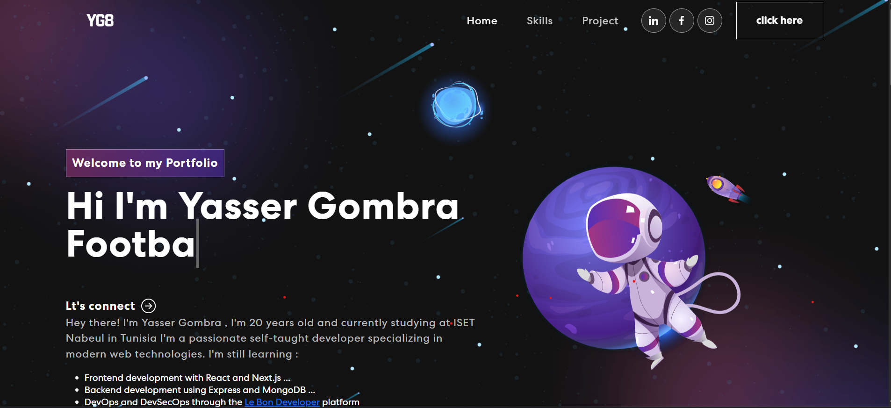

# Portfolio 🌟


A modern, responsive portfolio built with **React + Vite**, showcasing my projects, skills, and contact information.



---

## 🚀 Features
- ⚡ **Blazing Fast** (Vite-powered)
- 📱 **Fully Responsive** (Mobile, Tablet, Desktop)
- 🎨 **Smooth Animations** (Framer Motion or CSS)
- 📬 **Contact Form** (EmailJS or Netlify)

---

## 🛠️ Tech Stack
| Category       | Technologies Used                          |
|----------------|--------------------------------------------|
| **Frontend**   | React, Vite, JavaScript                    |
| **Styling**    | CSS3, Bootstrap                            |
| **Deployment** | GitHub Pages                               |
| **Tools**      |  Git                                       |

---

## 🖥️ Installation
1. Clone the repo:
   ```bash
   git clone https://github.com/YasserYG8/Portfolio.git
